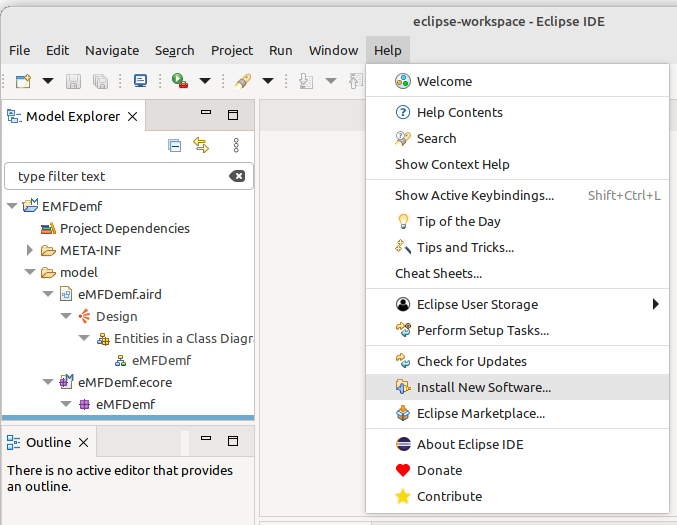

# Instalación de plugins

En esta sección se muestra los pasos para instalar los plugins EMF.

## Inicio de la instalación

Una vez que haya ejecutado Eclipse, vaya al menu ayuda (Help) y selecciona la opción instalar nuevo software.

## Software disponible

En la lista Work with, seleccionar "--All Available Sites"; luego en el listado de items desplegar el ítem "Modeling" y seleccionar:
- EMF - Ecore Diagram Editor (SDK) y,
- EMF - Eclipse Modeling Framework SDK.

Luego dar clic en siguiente (Next).

## Detalles de la instalación

En la pantalla de detalles de instalación volver a dar clic en siguiente.

## Revisión de la licencia

En la pantalla de revisión de la licencia, acepte los términos y de clic en finalizar (Finish).

## Progreso de la instalación.

Espere a que termine la instalación ya que puede demorar dependiendo de su conexión a internet. Puede ver el progreso haciendo clic en "Installing Software" en la parte inferior derecha del IDE.

## Reiniciar

Finalmente reiniciar el IDE cuando lo solicite.

Listo, eso es todo.
