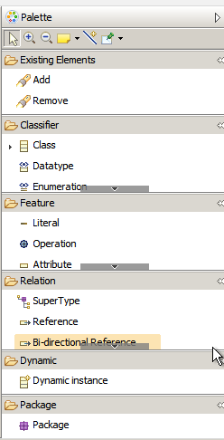
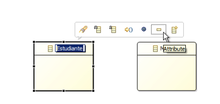
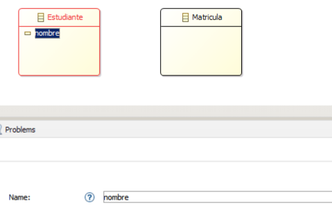
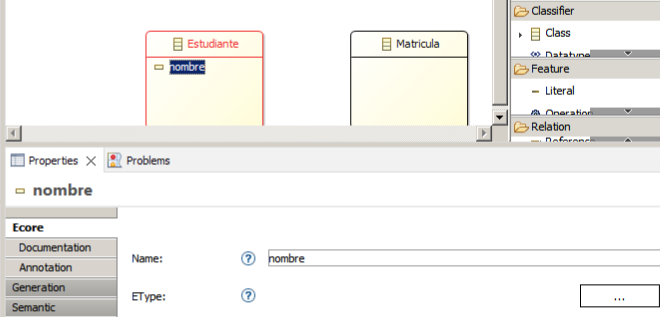
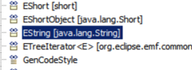
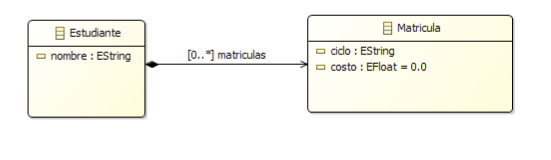
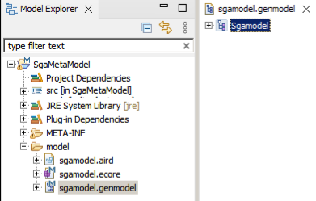
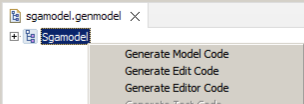
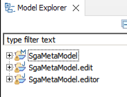

# Creación del modelo

Una vez instalado creado el proyecto, procedemos a crear el modelo, en la misma pantalla que nos abre el IDE. En la parte derecha tenemos disponible la paleta en donde se encuentran los diferemtes clasificadores, relaciones y demás.

Para el ejemplo, vamos a sar el clasificador "Class" y en relaciones "Composition".

## Agregar los clasificadores

Hacemos clic en el clasificador "Class" y luego en un área libre del diagrama para agregarlo.

## Cambiar nombre

Seleccionar un clasificador agregado y en la parte inferior se despliega las propiedades. En la parte del nombre ingresar según sea el caso.

## Agregar atributos

- Seleccionar un calsificador agregado y se desplegará un menú, del que se debe seleccionar el ícono [-].

    

- En las propiedades cambie el nombre del atributo

    

- En la propiedades, seleccione el botón [...] ubicado junto a EType.

    

- En el listado seleccione el tipo adecuado a al atributo, en este caso string.

    

- Luego para agregar un relación de composición desde estudiante hacia matrícula, cambiar el nombre a matrículas. De esta manera el digrama queda así:

    

## Generar del código del modelo

Primero abrimos el archivo .genmodel como se mestra a continuación:

Haciendo clic sobre el modelo (Sgamodel) se despliegan las opciones:

- Generate Model Code
- Generate Edit Code
- Generate Editor Code

Ejecutar una a una las opciones en el mismo orden, de tal manera que se crean los proyectos .edit y .editor

