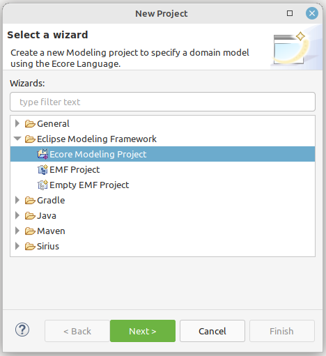
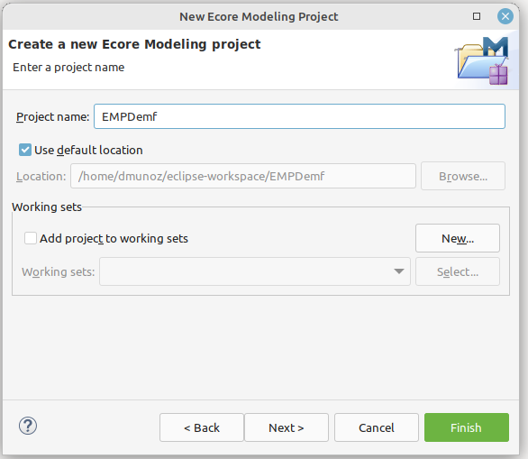
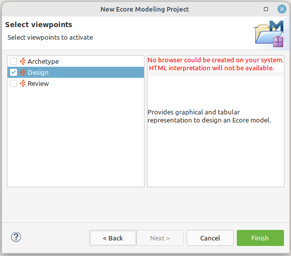
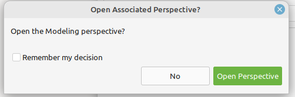

# Creación del proyecto

Una vez instalado lo necesario, vamos a crear el proyecto de modelado, para lo cual ejecutamos lo siguiente:

## Nuevo proyecto

- Ir al menú (File)

- Seleccionar la opción nuevo proyecto (New project)

- En la pantalla de selección de un wizards:

    - Despliegue la opción "Eclipse Modeling Framework"
    - Seleccione la opción "Ecore Modeling Project"
    - De clic en siguiente (Next).

## Nombre de proyecto

Luego ingrese el nombre del proyecto y de clic en finalizar.

## Activación de vistas

Seleccione la opción "Design" y de clic en finalizar.

## Abrir perspectiva asociada

Seleccionar la opción abrir perspectiva, para cargar la vista de edición del proyecto.

